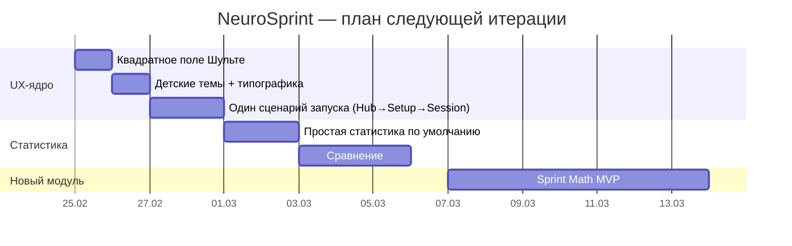

# NeuroSprint — единый план развития UX, статистики и расширения модулей для детей и взрослых

## Резюме для руководителя

NeuroSprint уже имеет рабочий базис: тренировка **Шульте** с режимами (включая timed), темы, настройки, сохранение результатов и продвинутую статистику. fileciteturn9file8 fileciteturn6file6 fileciteturn9file2 fileciteturn6file2

Следующий этап должен **не добавлять “ещё функций”**, а сделать продукт **понятным и приятным** для двух аудиторий сразу: детей и взрослых. Ключевые проблемы, которые вы отметили, действительно системные:

- поле Шульте визуально “сплющено” (не квадрат) — это прямой удар по воспринимаемому качеству;
- темы пока “технические”, а не “дружелюбные” (не хватает мультяшности/жирных цифр/яркости);
- статистика перегружена и теряет главную мысль — **видимый прогресс** + **понятное сравнение**;
- старт/запуск тренировки разъехался по нескольким местам — возникает путаница;
- пора расширять продукт новыми модулями, но делать это стоит только после стабилизации UX-ядра.

В этом отчёте я даю **единый UX-гайд (дети + взрослые)**, чёткую модель **понятной статистики**, а также **мини-спек Sprint Math** и план задач для AI-агента. Важно: рекомендации ниже **ещё не внедрены** и как раз предназначены для передачи агенту на реализацию.

## Продуктовая рамка: одна платформа для детей и взрослых

Чтобы NeuroSprint работал и на 3‑классника, и на взрослого, нужен не “детский режим” как отдельное приложение, а **настройка представления** (visual + density + explanations), при сохранении **одних и тех же данных/метрик**.

### Профили представления UI

Предлагаю 3 профиля UI (переключатель в Settings, хранить в local settings):

- **Kids (7–10)**: крупные элементы, минимальный текст, яркие темы, “больше = лучше”, короткие сессии, упор на мотивацию.  
- **Standard (11–15)**: умеренная плотность, больше контролов, объяснения метрик, первые сравнения.  
- **Pro (16+)**: компактнее, больше статистики на экране, расширенные графики/фильтры, экспорт/группы.

Технически это не ломает архитектуру: вы добавляете один флаг `uiProfile` и меняете:
- размеры (CSS variables),
- набор отображаемых блоков статистики,
- тексты/лейблы.

Это “разделение сложности”, а не “разделение кода”.

### Минимальные требования к интерактивным целям

Для детей особенно важны размеры кликабельных элементов. WCAG 2.2 вводит критерий минимального target size **24×24 CSS px**. citeturn3search0turn3search1  
Material Design рекомендует touch targets **48×48 dp**, и отдельно отмечает, что для детей “может быть уместно больше”. citeturn3search2turn3search4

Практическое правило для NeuroSprint:
- кнопки и клетки на телефоне: **не меньше 48×48 CSS px**, желательно 56×56 для Kids;
- расстояния между целями: не меньше ~8px (особенно в настройках).

## UX‑гайд NeuroSprint: поле Шульте, темы, старт, анти‑паттерны

### Поле Шульте должно быть квадратным

Ваше замечание точное: сейчас поле тянется по ширине, а по высоте ограничивается `min-height` у клетки — визуально получается прямоугольник. fileciteturn2file2  
Компонент сетки маркирует тему через `data-theme-id`, что удобно использовать для “детской типографики”. fileciteturn2file0

**Решение (без рефакторинга компонентов):**
- фиксировать размер board как квадрат через `aspect-ratio: 1 / 1` и ограничение `width: min(vmin, px)`;
- перевести строки grid в `1fr`, чтобы клетки тоже стали квадратными;
- убрать завязку на `min-height` как определяющую высоту поля.

**Патч‑идея (файл `src/app/styles.css`)** — агенту достаточно вставить/адаптировать:

```diff
.schulte-grid {
  display: grid;
+ width: min(92vmin, 560px);
+ aspect-ratio: 1 / 1;
+ margin: 0 auto;
- grid-template-columns: repeat(var(--grid-size, 5), minmax(48px, 1fr));
+ grid-template-columns: repeat(var(--grid-size, 5), 1fr);
+ grid-auto-rows: 1fr;
}

.grid-cell {
- min-height: 62px;
+ min-height: 0;
+ height: 100%;
+ display: grid;
+ place-items: center;
}
```

Критерий готовности: на 4×4/5×5/6×6 board остаётся квадратным на телефоне и на ноутбуке.

### Темы: нужны “детские” и “взрослые”, причём не только цвет

Сейчас темы описаны конфигом цветов (фон/клетка/цифра/подсветка/успех/ошибка). fileciteturn6file2  
Тип темы — отдельный union `SchulteThemeId`. fileciteturn6file0  
Проблема: “мультяшность” — это в первую очередь **типографика и пластика**, а не цвет.

**Решение без поломки типов/БД:**
- сохранить текущий `SchulteThemeConfig` как “палитру”;
- добавить **CSS‑слой** типографики по `data-theme-id` (у вас уже есть hook для этого). fileciteturn2file0

**Что добавить:**
- 4 детских темы (“Конфетки”, “Океан”, “Космос”, “Комикс”);
- 2 взрослые (“Минимал”, “Ночной контраст”);
- у детских: жирнее цифры, крупнее, мягкий `text-shadow`, чуть больше радиусы клеток;
- у взрослых: строже, контрастнее, меньше отвлекающих эффектов.

Критерий готовности: ребёнок визуально отличает “детскую тему” от обычной за 0.5 секунды (это и есть цель).

### Навигация и старт: один сценарий, без “двойного старта”

Сейчас старт ощущается размазанным: старт идёт с главной/настроек/сессии, что создаёт путаницу. fileciteturn17file0 fileciteturn6file6 fileciteturn9file8

**Запрещённый паттерн:** “Я уже нажал Start, почему снова Start?”

**Целевой UX:**
1) Пользователь выбирает модуль/режим/настройки **в одном месте** (Training Hub / Setup).  
2) На экране игры таймер стартует **по первому нажатию на клетку** (или по одной большой кнопке, но не дублируя старт везде).

Практичная схема:
- Главная: “Быстрый старт” → открывает Setup (с последним профилем/режимом).
- Setup: выбор режима/темы/сложности → “Начать”.
- Session: сетка активна сразу, таймер стартует при первом верном/любом клике (зависит от режима), кнопка “Сброс”.

Критерий готовности: пользователь не может попасть в ситуацию “я поменял тему и не понимаю, где запускать”.

## Статистика: понятные линейные графики прогресса и сравнения

Ваше требование правильное: график должен показывать не “палку из потолка”, а **наглядный прогресс** и **сравнение с другими**.

Сейчас статистика реализована мощно, но UX перегружен и теряет главный сигнал. fileciteturn9file2 fileciteturn9file4 fileciteturn9file3

### Принцип “метрика должна расти, если становится лучше”

Если показывать “время”, то улучшение — это падение линии (вниз), что мозгом читается хуже, особенно ребёнком.

Поэтому для основной линии используем “скорость”:
- Classic/Reverse: `speed = N / minutes` (чем быстрее — тем лучше).
- Timed: `effectiveCorrect / minutes` (чем больше — тем лучше).

Это делает график “ростом”, а не “падением”.

### Два уровня статистики

1) **Простая (по умолчанию)**  
   Для детей и большинства родителей:  
   - “Твоя скорость” (линия)  
   - “Твоя точность” (вторая линия, можно скрываемая)  
   - “Лучшее за день” (точки или отдельная тонкая линия)  
   - период 7/30 дней  
   Без сравнений и без 15 переключателей.

2) **Сравнение (по кнопке “Расширенно”)**  
   Взрослые/учитель:  
   - You vs **медиана группы** (вторая линия)  
   - “коридор группы” (25–75 перцентиль) как полупрозрачная зона  
   - процентиль ребёнка по дню (“ты в топ 30% сегодня”)  

Recharts позволяет строить LineChart с несколькими линиями, legend/tooltip и reference‑элементами. citeturn4search0turn4search2turn4search6

### Как показать сравнение “понятно”

На одном графике (на день/неделю) показываем:

- **Линия 1:** пользователь (rolling average 7 дней).  
- **Линия 2:** группа (median rolling average).  
- **Зона:** межквартильный размах (p25–p75) группы.  
- **Точки:** best‑of‑day для пользователя (не сглаженные).

И отдельно текстом над графиком:
- “За 7 дней: +12% к скорости, точность 90%”
- “Сейчас ты выше медианы группы на 8%”

Это объяснимо даже ребёнку: “я выше средней линии”.

### Какие данные нужны (и как их получить без изменения БД)

Не надо отдельной таблицы агрегатов — можно строить на лету:
- сгруппировать sessions по `localDate`,
- выбрать best‑of‑day,
- посчитать rolling average.

Для сравнения по группе:
- взять best‑of‑day по каждому участнику,
- посчитать median/p25/p75.

Если нужна скорость — пересчитать из stored fields (`speed`, `effectiveCorrect` уже есть в timed). fileciteturn6file0

### Мини‑пример модели графика (структура данных)

```ts
type DailyPoint = {
  date: string;                 // YYYY-MM-DD
  userBest: number;             // best-of-day speed
  userAvg7: number;             // rolling avg
  groupMedian7?: number;        // optional
  groupP25_7?: number;          // optional
  groupP75_7?: number;          // optional
  userAccuracy?: number;        // optional
};
```

Критерий готовности: человек за 10 секунд понимает (а) улучшилось ли, (б) насколько, (в) как относительно других.

## Расширение модулей: мини‑спек Sprint Math + рекомендации по backlog

Судя по вашему позиционированию, следующий модуль должен давать максимальный перенос в обучение: **скоростная математика**.

В репозитории уже отмечены “coming soon” модули (Sprint Math, N‑back). fileciteturn23file1

### Sprint Math — MVP‑спека

**Цель:** ускорить решение арифметики без потери точности.

**Сессия (60 секунд по умолчанию, опционально 30/90):**
- пользователю показывается пример;
- он вводит ответ (клавиатура/экранные кнопки);
- сразу получаем следующий пример.

**Типы заданий (3 класс + взрослые):**
- Kids: сложение/вычитание в пределах 20/100, “добей до 10”, “сотня+”.
- Standard: умножение/деление, смешанные операции.
- Pro: выражения 2–3 шага, отрицательные, дроби (опционально).

**Метрики (хранить в Session):**
- `correctCount`
- `errors`
- `throughput = correct/min`
- `accuracy = correct/(correct+errors)`
- `avgSolveMs` (среднее время на пример)
- `streakBest`

**Сложность (adaptive):**
- целевая точность 80–90%;
- если точность > 92% два дня подряд → поднять уровень;
- если < 70% → снизить.

**UI:**
- большая строка примера,
- большой input,
- крупная кнопка “ОК”,
- режим “авто‑Enter”: если ответ введён, Enter подтверждает.

Критерий готовности: ребёнок может решить 20–30 примеров за 60 сек на лёгком уровне и видеть прогресс по скорости/точности на графике.

### Рекомендуемый backlog после Sprint Math

Для вашей концепции (скорость реакции/мышления/память) следующий набор самый “рабочий”:

- **Go/No‑Go (реакция + контроль импульса)**  
- **Последовательности (рабочая память / Corsi‑lite)**  
- **Логические паттерны (закономерности)**  

Важное: новые игры добавлять только после унификации “Hub→Setup→Session” и перезапуска статистики, иначе продукт станет “сборником режимов”.

## План внедрения: задачи для AI‑агента, критерии готовности, риски

### Очерёдность (самая рациональная)

| Приоритет | Задача | Почему сейчас | Риск |
|---|---|---|---|
| High | Квадратное поле Шульте | мгновенный рост качества восприятия | низкий |
| High | Детские темы + типографика | мотивация + вовлечение | низкий |
| High | Один сценарий запуска (убрать двойной старт) | меньше путаницы, меньше “потерянных” пользователей | средний |
| Medium | Простая статистика по умолчанию + сравнение отдельным экраном | график становится понятным | средний |
| Medium | Сравнение с другими: median + p25/p75 + перцентиль | “реальное сравнение прогрессов” | средний |
| Medium | Sprint Math MVP | расширение платформы | средний/высокий |

### Таймлайн (Mermaid)



### Практический чек‑лист для агента (Definition of Done)

**Шульте квадрат:**
- board квадратный на телефоне/планшете/ноутбуке;
- клетки квадратные на 4×4/5×5/6×6.

**Темы:**
- есть минимум 4 детских темы + 2 взрослых;
- цифры заметно более “дружелюбные” в детских;
- сохраняется текущий механизм выбора темы. fileciteturn6file2

**Статистика:**
- “простая” страница: 7/30 дней, скорость + точность + best‑of‑day;
- “сравнение”: user vs median + коридор p25–p75, без визуального мусора.

**Старт:**
- из главной нельзя “обойти настройки” случайно (или быстрый старт = всё равно настройки);
- в игре нет двойного старта.

## Примечания по PWA и деплою

Если вы планируете GitHub Pages, Vite требует корректный `base`, если деплой в подпапку репозитория. citeturn2search1  
Для установки PWA через свою кнопку используется `beforeinstallprompt`, и MDN отмечает, что это событие **не стандартное** и реализовано в основном в Chromium‑браузерах. citeturn2search0turn2search2

Практический вывод:
- Android/Chromium: ваш in-app install UI работает;
- iOS: нужно текстовое объяснение “добавить на экран домой”.

## Что осталось неясным

Доступ к актуальному состоянию репозитория через подключенный GitHub‑коннектор в текущей сессии дал технические ошибки, поэтому в отчёте я опирался на данные из предыдущего аудита и уже полученные материалы репозитория, плюс на первичные источники общих практик (MDN/W3C/Vite/Dexie/Recharts). fileciteturn9file8 fileciteturn2file2 fileciteturn6file2 citeturn3search0turn2search1turn2search7turn4search0