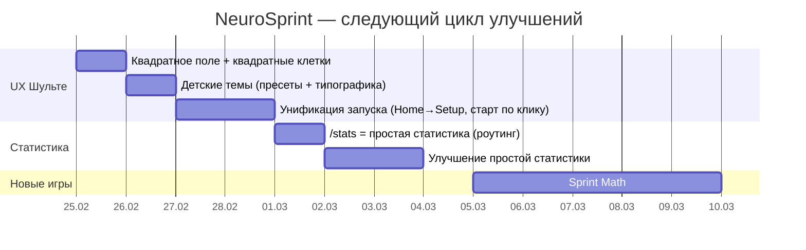

# NeuroSprint — план дальнейших улучшений по результатам анализа текущей версии

## Executive summary

Сейчас NeuroSprint уже выглядит как рабочий продукт: есть полноценный модуль **Шульте** (Classic+/Timed+/Reverse), настройки (пресеты, подсказки, штраф, стратегия спавна), сохранение сессий и дневные агрегаты, а также “тяжёлая” индивидуальная/групповая аналитика. fileciteturn9file8 fileciteturn6file6 fileciteturn9file2 fileciteturn23file1

Дальше надо сделать два шага, которые резко поднимут “детскость” и понятность:

- **Шульте-поле сделать квадратным** + квадратные ячейки (сейчас сетка растягивается по ширине, а высота ограничена `min-height`, из-за чего доска визуально “сплющена”). fileciteturn2file2 fileciteturn2file0  
- **Добавить детские визуальные стили**: не только цвета, но и “человеческие” цифры — крупнее, жирнее, дружелюбнее (включая “мультяшный” вариант). Сейчас темы есть, но они скорее взрослые и “умные”, чем детские. fileciteturn6file2 fileciteturn6file0  
- **Упростить статистику по умолчанию**: оставить “простую статистику” на /stats, а тяжёлую аналитику сравнения/групп — спрятать под “Расширенно”. Сейчас пункт “Статистика” ведёт в перегруженный экран. fileciteturn9file4 fileciteturn9file3 fileciteturn9file2  
- **Развести “запуск тренировки” и “старт таймера”**: сейчас логика старта ощущается в нескольких местах (Главная → сразу игра; Setup → “Начать тренировку”; Session → “Начать”). Это и создаёт путаницу. fileciteturn17file0 fileciteturn6file6 fileciteturn9file8  

И только после этого имеет смысл добавлять новые игры: будет ясный UX-фундамент, иначе вы масштабируете путаницу (а она масштабируется лучше всего, к сожалению).

## Что есть сейчас и почему возникли ваши ощущения

### Почему поле Шульте “прямоугольное”

Компонент `SchulteGrid` рендерит контейнер `.schulte-grid`, а размер колонок задаётся через CSS grid и `--grid-size`. fileciteturn2file0  
В CSS у `.schulte-grid` нет ограничения “квадратности”, зато у `.grid-cell` задан `min-height: 62px`. Это означает:

- ширина поля растёт вместе с контейнером (панель широкая → поле широкое),
- высота поля ограничена суммой `min-height` по строкам,
- результат — поле визуально шире, чем выше. fileciteturn2file2  

### Почему темы “не детские”

Темы сейчас — это только набор цветов (board/cell/number/highlight/success/error). fileciteturn6file2  
Тип `SchulteThemeConfig` не содержит параметров шрифта/толщины/эффектов цифр, поэтому “мультяшность” физически неоткуда взять, кроме CSS-хаков по `data-theme-id`. fileciteturn6file0 fileciteturn2file0

### Почему статистика ощущается сложной и бесполезной

Меню “Статистика” ведёт на `/stats`, который редиректит на `/stats/individual`. fileciteturn9file4 fileciteturn9file3  
`StatsIndividualPage` одновременно пытается быть:

- дневным графиком по режиму,
- сводкой “streak/неделя/стабильность”,
- сравнением “я vs другой пользователь vs группа vs все”,
- плюс режимы и период и метрика — всё сразу. fileciteturn9file2  

Для ребёнка 3 класса это просто “много кнопок и непонятно зачем”. Для взрослого — тоже перегруз, если цель “понять прогресс за неделю”.

### Почему старт “в двух местах”

Сейчас реально три “точки старта”:

- Главная: кнопки сразу ведут в `/training/schulte/<mode>` (минуя настройки). fileciteturn17file0  
- Setup: “Начать тренировку” ведёт на session page и сохраняет настройки/предпочтения. fileciteturn6file6  
- Session: “Начать” стартует таймер/игру (а до этого сетка disabled). fileciteturn9file8  

Да, это рабоче, но UX ощущается как “я уже начал — почему мне снова надо начать?”.

## Улучшения Шульте: квадратность, детские темы, понятный старт

### Квадратное поле и квадратные клетки

Цель: сделать так, чтобы доска всегда выглядела как **квадрат** и клетки были **квадратными**, независимо от ширины панели.

Решение: закрепить размер поля через `vmin` + `aspect-ratio: 1`, а строки сделать `1fr`, чтобы клетки реально заполняли квадрат по высоте.

**Патч (файл `src/app/styles.css`)** fileciteturn2file2

```diff
diff --git a/src/app/styles.css b/src/app/styles.css
--- a/src/app/styles.css
+++ b/src/app/styles.css
@@
 .schulte-grid {
   display: grid;
-  grid-template-columns: repeat(var(--grid-size, 5), minmax(48px, 1fr));
+  /* Доска всегда квадратная и подстраивается под меньшую сторону экрана */
+  width: min(92vmin, 560px);
+  aspect-ratio: 1 / 1;
+  margin: 0 auto;
+
+  grid-template-columns: repeat(var(--grid-size, 5), 1fr);
+  grid-auto-rows: 1fr;
   gap: 10px;
   padding: 10px;
   border-radius: 14px;
   background: var(--schulte-board-bg, #f8fcfa);
   border: 1px solid #cfe4dc;
 }
 
 .grid-cell {
-  min-height: 62px;
+  min-height: 0;
+  height: 100%;
+  display: grid;
+  place-items: center;
   border-radius: 12px;
   border: 2px solid #c8dfd6;
   background: var(--schulte-cell-bg, #fff);
   color: var(--schulte-number-color, var(--text-primary));
-  font-size: clamp(1.1rem, 2vw, 1.5rem);
+  font-size: var(--schulte-number-size, clamp(1.1rem, 2.4vmin, 1.7rem));
-  font-weight: 800;
+  font-weight: var(--schulte-number-weight, 800);
+  font-family: var(--schulte-number-font, "Trebuchet MS","Segoe UI",sans-serif);
   cursor: pointer;
   transition: transform 0.12s ease, border-color 0.12s ease;
 }
```

Этого достаточно, чтобы поле перестало быть “прямоугольником”. Визуально эффект будет заметен сразу.

### Детские темы: цвета + “характер” цифр

Сейчас темы в `themes.ts` — 4 штуки (Ч/Б, Контраст, Мягкая, Радуга). fileciteturn6file2  
Предлагаю добавить минимум 4 “детских” пресета, где меняется:

- фон/клетки (цвета),
- шрифт/толщина,
- размер цифр,
- лёгкий “мультяшный” объём (text-shadow).

Чтобы не ломать типизацию и хранение, лучше:

1) расширить `SchulteThemeId` новыми значениями, fileciteturn6file0  
2) добавить цвета в `themes.ts`, fileciteturn6file2  
3) добавить стилевые CSS-правила по `data-theme-id` (это уже прокинут компонентом). fileciteturn2file0 fileciteturn2file2

**Патч 1: `src/shared/types/domain.ts` (добавить новые theme id)** fileciteturn6file0

```diff
- export type SchulteThemeId = "classic_bw" | "contrast" | "soft" | "rainbow";
+ export type SchulteThemeId =
+   | "classic_bw"
+   | "contrast"
+   | "soft"
+   | "rainbow"
+   | "kid_candy"
+   | "kid_ocean"
+   | "kid_space"
+   | "kid_comics";
```

**Патч 2: `src/shared/lib/training/themes.ts` (пресеты + labels)** fileciteturn6file2

```diff
 export const SCHULTE_THEME_PRESETS: Record<SchulteThemeId, SchulteThemeConfig> = {
@@
   rainbow: { ... },
+  kid_candy: {
+    boardBg: "#fff0f6",
+    cellBg: "#ffffff",
+    numberColor: "#4a154b",
+    highlightColor: "#ff4d6d",
+    successColor: "#2ecc71",
+    errorColor: "#ff6b6b"
+  },
+  kid_ocean: {
+    boardBg: "#e6fbff",
+    cellBg: "#ffffff",
+    numberColor: "#0b3d5c",
+    highlightColor: "#00a3ff",
+    successColor: "#00c48c",
+    errorColor: "#ff5a5f"
+  },
+  kid_space: {
+    boardBg: "#0b1020",
+    cellBg: "#141b34",
+    numberColor: "#eaf2ff",
+    highlightColor: "#8a5cff",
+    successColor: "#2ecc71",
+    errorColor: "#ff6b6b"
+  },
+  kid_comics: {
+    boardBg: "#fff7d6",
+    cellBg: "#ffffff",
+    numberColor: "#222222",
+    highlightColor: "#ffb703",
+    successColor: "#00b894",
+    errorColor: "#d63031"
+  }
 };
@@
 export const SCHULTE_THEME_OPTIONS = [
   { id: "classic_bw", label: "Ч/Б" },
   { id: "contrast", label: "Контраст" },
   { id: "soft", label: "Мягкая" },
   { id: "rainbow", label: "Радуга" },
+  { id: "kid_candy", label: "Конфетки" },
+  { id: "kid_ocean", label: "Океан" },
+  { id: "kid_space", label: "Космос" },
+  { id: "kid_comics", label: "Комикс" }
 ];
```

**Патч 3: `src/app/styles.css` (мультяшность через data-theme-id)** fileciteturn2file2 fileciteturn2file0

```css
.schulte-grid[data-theme-id="kid_candy"],
.schulte-grid[data-theme-id="kid_ocean"],
.schulte-grid[data-theme-id="kid_space"],
.schulte-grid[data-theme-id="kid_comics"] {
  --schulte-number-font: ui-rounded, system-ui, "Comic Sans MS", "Trebuchet MS", sans-serif;
  --schulte-number-weight: 900;
  --schulte-number-size: clamp(1.25rem, 3.0vmin, 2.1rem);
}

.schulte-grid[data-theme-id="kid_candy"] .grid-cell,
.schulte-grid[data-theme-id="kid_comics"] .grid-cell {
  text-shadow: 0 1px 0 rgba(0,0,0,0.12);
}

.schulte-grid[data-theme-id="kid_space"] .grid-cell {
  border-color: rgba(255,255,255,0.18);
  text-shadow: 0 0 10px rgba(138,92,255,0.25);
}
```

Это даст сразу “детский характер” без добавления тяжёлых UI-фреймворков и без ломки модели данных.

### Убрать путаницу со стартом: один маршрут запуска и старт по первому нажатию

Сейчас игрок может:

- стартовать прямо с Главной (мимо настройки), fileciteturn17file0  
- стартовать через Setup, fileciteturn6file6  
- и потом ещё раз нажать “Начать” на сессии. fileciteturn9file8  

Нужно сделать так:

- **Запуск режима**: только через Setup (или через “быстрый старт”, который фактически открывает Setup с выбранным режимом).
- **Старт таймера/игры**: по первому нажатию на клетку (как в классических тренажёрах).

#### Изменение A: Главная → ведёт в Setup с выбранным режимом

`src/pages/HomePage.tsx`: заменить ссылки на `/training/schulte/<mode>` на `/training/schulte?mode=<mode>` (или state). fileciteturn17file0

#### Изменение B: Setup читает параметр mode

`src/pages/SchulteSetupPage.tsx`: добавить чтение query параметра и выставлять `modeId`.

#### Изменение C: Session стартует по первому нажатию и сетка не disabled до старта

`src/pages/SchulteSessionPage.tsx`: убрать необходимость кнопки “Начать” (или сделать её вторичной), разрешить клик по сетке и стартовать при первом клике.

Это реально уберёт ощущение “я уже нажал начать — почему я ещё не начал”.

## Статистика: сделать “понятно” и оставить “умно” отдельно

### Что сделать по UX

Сейчас “Статистика” ведёт в продвинутый экран. fileciteturn9file4 fileciteturn9file3 fileciteturn9file2  
Но в репозитории уже есть **простая страница** статистики по дням (`StatsPage.tsx`), она просто не используется в роутинге. fileciteturn9file0 fileciteturn9file3  

Правильная упаковка:

- `/stats` → **простая статистика** (по дням, без сравнений, понятные подписи, короткие выводы).
- `/stats/individual` → “Расширенно” (сравнения, streak, рекомендации).
- `/stats/group` → групповой отчёт (для класса).

### Конкретное изменение роутинга

`src/app/App.tsx`: вместо редиректа на `/stats/individual` сделать `/stats` = `StatsPage`. fileciteturn9file3 fileciteturn9file0

Плюс внутри `StatsPage.tsx` добавить кнопку “Расширенная статистика” → `/stats/individual`. fileciteturn9file0 fileciteturn9file2

### Что улучшить в простой статистике, чтобы она была “как задумано”

Минимально (и очень полезно):

- вместо `YYYY-MM-DD` показывать “24.02”, чтобы ребёнок понимал (это чисто форматирование, данные остаются те же). fileciteturn9file0  
- для Classic показывать **лучшее время/день** (уже есть) + **точность среднюю/день** (сейчас не выводится в графике).  
- для Timed показывать **эффективные правильные/мин** (уже есть) и отдельно **точность**, а не мешать `effective/min` и `avgScore` на одном графике (score — это “внутренняя” метрика, детям важнее понятная “сколько успел правильно”). fileciteturn9file0 fileciteturn6file0  

Таблица “что показывать по режимам” (понятно и честно):

| Режим | Главная метрика | Доп. метрика качества | Почему это понятно |
|---|---|---|---|
| Classic+ | Лучшее время (сек) | Точность (%) / ошибки | “Чем меньше время, тем лучше”, точность объясняет почему время не всегда цель |
| Timed+ | Эффективные правильные/мин | Точность (%) | “Сколько успел правильно за минуту” + не поощряем тыкать наугад |
| Reverse | Лучшее время (сек) | Точность (%) | То же, что classic, но тренирует переключение/контроль |

## Расширение: какие игры добавить дальше и в каком порядке

У вас правильная цель: скорость мышления = скорость обработки + точность. Шульте закрывает внимание и поиск, но не закрывает:

- скорость счёта,
- реакцию выбора,
- рабочую память.

С учётом вашей концепции и возраста 3 класса, следующий адекватный набор (по максимальному “переносу” в учёбу):

### Sprint Math

Короткие серии примеров (20–60 сек), адаптивная сложность.

Метрики:
- примеров/мин,
- точность,
- среднее время на пример,
- “серия без ошибок”.

Это прямо бьёт в “математику, скорость решения задач”.

### Go/No-Go

Поток стимулов (например, нажимать только на зелёный круг или только на чётные числа).

Метрики:
- среднее время реакции,
- ложные срабатывания,
- пропуски,
- точность.

Это “скорость реакции + контроль импульсивности”.

### Память последовательности (Corsi-lite)

Показывается последовательность подсветок 3–8 клеток, ребёнок повторяет.

Метрики:
- максимальная длина,
- % правильных,
- время ответа.

Это рабочая память — то, что реально помогает удерживать шаги при решении задач.

Сейчас архитектурно у вас “модули” уже заведены как карточки (Schulte активен, Sprint Math/N-back помечены coming soon). fileciteturn23file1 fileciteturn23file0  
Значит следующий шаг — довести “Sprint Math” до реального модуля и добавить новый `taskId`/тип сессии по аналогии со Schulte.

## Приоритетный план работ, оценка усилий и календарь

### Приоритеты на ближайшие итерации

| Приоритет | Задача | Эффект | Оценка |
|---|---|---|---:|
| High | Квадратное поле Шульте + квадратные клетки | мгновенно улучшает ощущение качества | 1–2 ч |
| High | Детские темы (4 пресета + шрифт/жирность/стиль) | “вау-эффект” для детей и мотивация | 2–4 ч |
| High | Один сценарий запуска (Home→Setup; Session старт по клику) | убирает путаницу “двойного старта” | 3–6 ч |
| Medium | `/stats` = простая статистика, advanced отдельно | статистика становится полезной | 2–5 ч |
| Medium | Улучшить простую статистику (точность отдельно, формат дат) | понятный прогресс | 3–6 ч |
| Medium | Sprint Math (первый новый модуль) | расширение продукта в “учёбу” | 10–18 ч |

### Mermaid Gantt



## Как действовать дальше, чтобы AI-агент реализовал это без хаоса

Поскольку вы не программист, вам нужен сценарий “задача → результат → проверка”.

Рекомендуемый порядок задач для агента:

1) **Сетка квадратная**
- “Внеси патч в `src/app/styles.css` (aspect-ratio, vmin, grid-auto-rows). Проверь визуально 3×3, 4×4, 5×5, 6×6.”

2) **Детские темы**
- “Расширь `SchulteThemeId` в `domain.ts`, добавь пресеты в `themes.ts`, добавь CSS по `data-theme-id`. Убедись, что кнопки тем появились в Setup.”

3) **Унифицировать запуск**
- “HomePage ведёт на Setup, Setup выбирает режим из query param, Session стартует по первому нажатию (без отдельной кнопки Start, либо кнопка вторичной).”

4) **Статистика по умолчанию простая**
- “В App.tsx сделай `/stats` показывать StatsPage; добавь кнопку ‘Расширенно’ → `/stats/individual`.”

Контрольные команды (после каждой задачи):

```powershell
npm run build
npm test
```

Если агент внёс изменения и что-то сломалось — это нормально. Ненормально оставлять это сломанным.

---

Если хотите, я подготовлю следующий артефакт: **единый документ “UX-гайд NeuroSprint для детей 7–10 лет”** (цвета, типографика, размеры, логика экранов, запрещённые паттерны типа “двойного старта”) и отдельный мини-спек для Sprint Math.