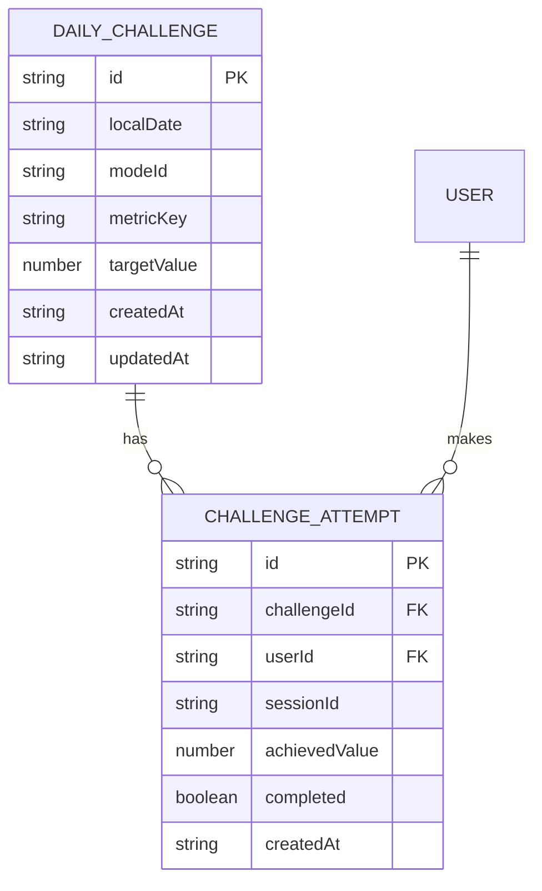
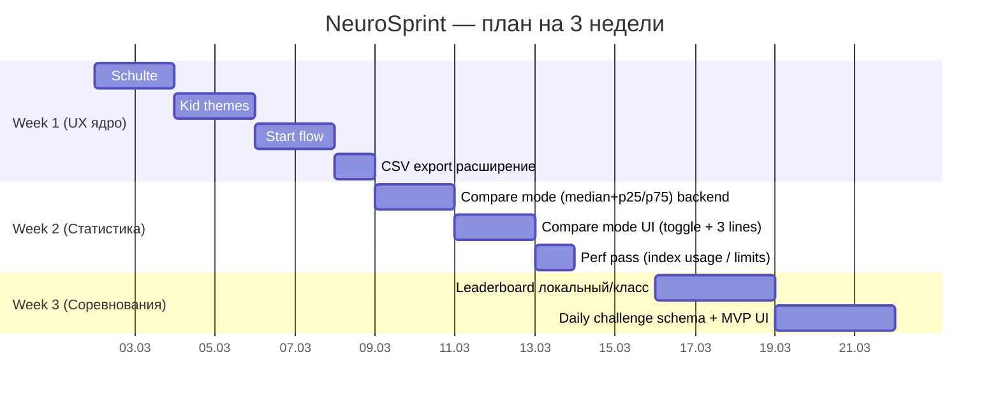

# NeuroSprint — краткий actionable‑отчёт и план работ для AI‑агента

## Executive summary

Репозиторий **DREDGV/NeuroSprint** сейчас — это **alpha‑платформа**, не MVP: PWA, профили/классы, расширенный Шульте, базовая статистика, экспорт, и уже начат **Sprint Math**. Стек: **React 18 + TypeScript + Vite + Dexie (IndexedDB) + Recharts + vite-plugin-pwa**, версия в `package.json` — **0.5.0-dev.1**. fileciteturn46file0 fileciteturn47file0  

Что **новое vs прошлый аудит** (где это было “нужно сделать”):  
- **Поле Шульте квадратное** (`aspect-ratio: 1/1`, `grid-auto-rows: 1fr`) + токены типографики. fileciteturn30file3  
- **4 детские темы** уже заведены (`kid_*`) и подключены. fileciteturn30file0 fileciteturn30file2  
- Поток запуска улучшен: есть **PreSession → Setup → Session**, а в сессии есть **старт по первому клику** (но всё ещё можно упростить путь “быстрый старт”). fileciteturn35file0 fileciteturn36file0 fileciteturn38file0  
- `/stats` существует как “простая” статистика (вместо сразу тяжёлой). fileciteturn39file0 fileciteturn34file0  
- **CSV экспорт** уже есть в Settings (его стоит расширить). fileciteturn41file0  
- БД Dexie уже на **version(7)**, есть compound‑индексы под быстрые выборки (важно для сравнений/лидербордов). fileciteturn44file0  

Ниже — 8–12 конкретных задач на 3 недели. Top‑High закрывают: квадратность/темы/старт/статистика‑сравнение/CSV.

---

## Приоритетные задачи (8–12) с файлами, часами и критериями приёмки

| Priority | Задача | Файлы (точно) | Оценка | Acceptance criteria (проверка) |
|---|---|---|---:|---|
| **High** | **Шульте: довести квадратность и читабельность 6×6** (gap/типографика/тач) | `src/app/styles.css` | 1–2ч | 4×4/5×5/6×6: поле квадрат, клетки квадрат, цифры читаемы на мобиле и ноутбуке |
| **High** | **Kid‑темы: токены “детскости”** (радиус/обводка/тень/шрифт) | `src/app/styles.css`, `src/shared/lib/training/themes.ts` | 2–4ч | 4 kid‑темы заметно отличаются (крупнее/жирнее), переключение не ломает цветовую схему |
| **High** | **Единый старт‑флоу**: “Home→Setup→Session”, PreSession оставить отдельной кнопкой; “старт по первому клику” — основной | `src/pages/HomePage.tsx`, `src/pages/TrainingHubPage.tsx`, `src/pages/PreSessionPage.tsx`, `src/pages/SchulteSessionPage.tsx`, `tests/e2e/smoke.spec.ts` | 3–6ч | С главной можно запустить игру за 2 клика; в сессии старт идёт с первого нажатия по клетке; e2e smoke проходит |
| **High** | **/stats: добавить режим “Сравнение”** (median + p25/p75 по дням на локальных данных) | `src/entities/session/sessionRepository.ts`, `src/pages/StatsPage.tsx` | 5–8ч | Toggle “Сравнение” добавляет линии median/p25/p75; работает на демо‑данных; не падает при 0 данных |
| **High** | **CSV экспорт расширить** (userPreferences + userModeProfiles) | `src/pages/SettingsPage.tsx` | 1–2ч | Кнопка “Экспорт” скачивает доп. CSV, поля заполнены; проверка открытием в Excel/Sheets |
| Medium | Sprint Math: довести MVP до стабильной сессии (режимы 30/60/90, авто‑enter, метрики) | `src/pages/SprintMathSetupPage.tsx`, `src/features/sprint-math/contract.ts`, *(session page если есть)* | 8–14ч | 60 сек решается без лагов; сохраняет correct/errors/accuracy/speed; график в /stats отображает |
| Medium | Конкуренция “локальная/класс”: лидерборд топ‑10 (по дню/неделе) + перцентиль | `src/db/database.ts`, `src/entities/group/groupRepository.ts`, `src/pages/StatsGroupPage.tsx` | 10–16ч | Экран показывает топ‑10; выделяет активного пользователя; работает офлайн |
| Medium | Daily challenge (локально): “задача дня” и попытки | `src/db/database.ts`, `src/pages/HomePage.tsx` *(виджет)* | 10–16ч | Есть “челлендж дня”, попытка сохраняется, “выполнено/не выполнено” видно |
| Low | UI Profiles Kids/Standard/Pro (плотность/подсказки/цифры/кнопки) | `src/pages/SettingsPage.tsx`, `src/app/styles.css`, `src/shared/types/domain.ts` | 6–10ч | Переключатель меняет размеры/подсказки/показ блоков статистики |
| Low | CI: build + test + e2e smoke | `.github/workflows/ci.yml` | 2–4ч | Push/PR запускает `npm test`, `npm run build`, `npm run test:e2e` |

---

## Патчи/сниппеты для High‑задач (готово к применению агентом)

### High 1 — Шульте: квадратность/читабельность/тач

Файл: `src/app/styles.css` fileciteturn30file3

```diff
diff --git a/src/app/styles.css b/src/app/styles.css
@@
 .schulte-grid {
   display: grid;
+  gap: clamp(6px, 1.2vmin, 10px);
 }
 
 .grid-cell {
+  touch-action: manipulation;
+  -webkit-tap-highlight-color: transparent;
+  min-height: 0;
+  height: 100%;
+  display: grid;
+  place-items: center;
 }
```

### High 2 — 4 kid‑темы: CSS‑токены “детскости” (без ломки типов)

Файл: `src/app/styles.css` fileciteturn30file3  
(темы `kid_*` уже есть в пресетах) fileciteturn30file0

```diff
diff --git a/src/app/styles.css b/src/app/styles.css
@@
 .schulte-grid[data-theme-id="kid_candy"],
 .schulte-grid[data-theme-id="kid_ocean"],
 .schulte-grid[data-theme-id="kid_space"],
 .schulte-grid[data-theme-id="kid_comics"] {
   --schulte-number-font: ui-rounded, "Trebuchet MS", "Segoe UI", sans-serif;
   --schulte-number-weight: 900;
   --schulte-number-size: clamp(1.22rem, 3.1vmin, 2.1rem);
+  --schulte-cell-radius: 16px;
+  --schulte-cell-border: 3px;
 }
 
 .grid-cell {
-  border-radius: 12px;
-  border: 2px solid var(--schulte-cell-border-color, #c8dfd6);
+  border-radius: var(--schulte-cell-radius, 12px);
+  border-width: var(--schulte-cell-border, 2px);
 }
```

### High 3 — Старт‑флоу: быстрый запуск с Home напрямую в Setup, PreSession отдельной кнопкой

Файл: `src/pages/HomePage.tsx` fileciteturn37file0  
(предполагается маршрут setup по query `?mode=...` уже поддержан или добавить в setup)

```diff
diff --git a/src/pages/HomePage.tsx b/src/pages/HomePage.tsx
@@
- <Link to="/training/pre-session?mode=classic_plus">Начать Classic</Link>
+ <Link to="/training/schulte?mode=classic_plus">Начать Classic</Link>
@@
- <Link to="/training/pre-session?mode=timed_plus">Начать Timed</Link>
+ <Link to="/training/schulte?mode=timed_plus">Начать Timed</Link>
@@
- <Link to="/training/pre-session?mode=reverse">Начать Reverse</Link>
+ <Link to="/training/schulte?mode=reverse">Начать Reverse</Link>
+
+ <Link to="/training/pre-session">План на день</Link>
```

Обновить smoke тест под авто‑старт по клику (кнопка старта может исчезнуть/не требоваться):

Файл: `tests/e2e/smoke.spec.ts` fileciteturn40file0

```diff
diff --git a/tests/e2e/smoke.spec.ts b/tests/e2e/smoke.spec.ts
@@
- await expect(page.getByTestId("pre-session-page")).toBeVisible();
- await page.getByTestId("pre-session-start-btn").click();
  await expect(page.getByTestId("schulte-setup-page")).toBeVisible();
  await page.getByTestId("setup-start-btn").click();
- await page.getByTestId("schulte-start").click();
```

### High 4 — /stats: сравнение median + p25/p75 (локальные пользователи/группа устройства)

Основа: Dexie compound‑индексы рекомендуется использовать как `where('[a+b]').equals([a,b])`. citeturn1search3  
Индексы уже есть/расширялись в DB (включая timestamp‑варианты). fileciteturn44file0  

**Патч‑сниппет** (вставить в `src/entities/session/sessionRepository.ts`): fileciteturn45file0

```ts
import Dexie from "dexie";
import { db } from "../../db/database";

function quantile(sorted: number[], q: number): number {
  if (sorted.length === 0) return 0;
  const pos = (sorted.length - 1) * q;
  const base = Math.floor(pos);
  const rest = pos - base;
  const next = sorted[base + 1] ?? sorted[base];
  return sorted[base] + rest * (next - sorted[base]);
}

export async function aggregateCompareBandByDay(modeId: string, fromDateKey: string) {
  const sessions = await db.sessions
    .where("[modeId+localDate]")
    .between([modeId, fromDateKey], [modeId, Dexie.maxKey])
    .toArray();

  const byDate = new Map<string, Map<string, number>>();
  for (const s of sessions) {
    const date = s.localDate;
    if (!date) continue;
    const perUser = byDate.get(date) ?? new Map<string, number>();
    const val = s.score; // MVP: сравнение по score; позже можно переключать на speed/effective/min
    const prev = perUser.get(s.userId);
    if (prev == null || val > prev) perUser.set(s.userId, val);
    byDate.set(date, perUser);
  }

  return [...byDate.entries()]
    .map(([date, perUser]) => {
      const vals = [...perUser.values()].sort((a, b) => a - b);
      return { date, p25: quantile(vals, 0.25), p50: quantile(vals, 0.5), p75: quantile(vals, 0.75), users: vals.length };
    })
    .sort((a, b) => a.date.localeCompare(b.date));
}
```

В `src/pages/StatsPage.tsx` добавить toggle `Сравнение` и на график вывести линии `p50/p25/p75` (Recharts это поддерживает; для зоны можно позже использовать `ReferenceArea`). citeturn1search7 fileciteturn39file0  

### High 5 — CSV экспорт расширить

Файл: `src/pages/SettingsPage.tsx` fileciteturn41file0  
(добавить `db.userPreferences`, `db.userModeProfiles` — таблицы уже есть в базе) fileciteturn44file0

```diff
diff --git a/src/pages/SettingsPage.tsx b/src/pages/SettingsPage.tsx
@@
-const [users, sessions, groups, members] = await Promise.all([
+const [users, sessions, groups, members, prefs, modeProfiles] = await Promise.all([
   userRepository.list(),
   db.sessions.toArray(),
   db.classGroups.toArray(),
-  db.groupMembers.toArray()
+  db.groupMembers.toArray(),
+  db.userPreferences.toArray(),
+  db.userModeProfiles.toArray()
 ]);
@@
+const prefsCsv = toCsv(["id","userId","schulteThemeId","updatedAt"], prefs.map(p=>[p.id,p.userId,p.schulteThemeId,p.updatedAt]));
+const profilesCsv = toCsv(
+ ["id","userId","moduleId","modeId","level","autoAdjust","manualLevel","updatedAt"],
+ modeProfiles.map(m=>[m.id,m.userId,m.moduleId,m.modeId,m.level,String(m.autoAdjust),m.manualLevel ?? "",m.updatedAt])
+);
@@
+downloadTextFile(`neurosprint_user_preferences_${stamp}.csv`, prefsCsv, "text/csv;charset=utf-8");
+downloadTextFile(`neurosprint_user_mode_profiles_${stamp}.csv`, profilesCsv, "text/csv;charset=utf-8");
```

---

## 6 новых игровых модулей — MVP‑спеки (UI + метрики + session fields)

> Принцип: всё пишем в `sessions`, расширяя `taskId/modeId` и поля метрик (опциональные). Типы/контракт — по аналогии со Schulte и Sprint Math. fileciteturn30file2

1) **Sprint Math** (уже начат)  
UI: пример → ввод → Enter/OK, таймер 60s. fileciteturn54file0 fileciteturn55file0  
Метрики: `correctCount`, `errors`, `accuracy`, `speed`, `avgSolveMs`, `streakBest`.  
Session fields: `difficulty.timeLimitSec`, `difficulty.tierId`, `difficulty.autoEnter`.

2) **Go/No‑Go**  
UI: поток объектов, “нажимай только если …”.  
Метрики: `reactionAvgMs`, `falsePositives`, `misses`, `accuracy`.  
Fields: `difficulty.rateHz`, `difficulty.ruleId`.

3) **Memory Sequence (Corsi‑lite)**  
UI: подсветки → повтор.  
Метрики: `spanMax`, `accuracy`, `avgRecallMs`.  
Fields: `difficulty.gridSize`, `difficulty.startLen`.

4) **Choice Reaction**  
UI: несколько кнопок/цветов, выбрать верное соответствие.  
Метрики: `reactionAvgMs`, `reactionP90Ms`, `accuracy`.  
Fields: `difficulty.choicesCount`, `difficulty.mappingId`.

5) **Pattern Logic**  
UI: последовательности/матрицы.  
Метрики: `correctCount`, `accuracy`, `avgSolveMs`.  
Fields: `difficulty.level`, `difficulty.familyId`.

6) **N‑back (kids 1‑back/2‑back)**  
UI: стимулы + “да/нет”.  
Метрики: `hits`, `falseAlarms`, `accuracy` (опц. `dPrime`).  
Fields: `difficulty.n`, `difficulty.rateHz`, `difficulty.symbolSet`.

---

## Соревнования: лидерборды, daily challenges, percentiles (офлайн)

### Фичи (простые, но “держат” пользователей)
- **Локальный лидерборд**: топ‑10 пользователей устройства по режиму за день/неделю.
- **Класс/группа**: лидерборд по `classGroups` (таблицы уже есть). fileciteturn44file0 fileciteturn42file0
- **Daily challenge**: одно правило/режим/цель в день.
- **Percentile**: “ты в топ‑30% сегодня” (по распределению best‑of‑day).

### Изменения БД (Dexie v8) + индексы



Индексы:
- `dailyChallenges`: `id, localDate, modeId, [localDate+modeId]`
- `challengeAttempts`: `id, challengeId, userId, [challengeId+userId], [userId+createdAt]`

Запросы (пример):
- best‑of‑day для режима: `db.sessions.where('[modeId+localDate]').equals([modeId, dateKey])…` citeturn1search3 fileciteturn44file0  
- best‑of‑day per‑user: группировать по `userId`, брать max(score) или max(speed).

---

## UI/визуальный чеклист (Kids / Standard / Pro)

Минимальный размер target по WCAG 2.2: **24×24 CSS px** (лучше больше). citeturn0search1  
Material: touch target **48×48 dp** + spacing 8dp; “для детей можно больше”. citeturn0search0  

**Kids**
- высота кнопок ≥56px, клетки ≥56px; шрифт 900, `clamp(1.3rem…2.2rem)`
- темы kid_* в топе, score скрыт, подсказки включены
- минимум переключателей на экране, один главный CTA

**Standard**
- кнопки 48–52px, показывать speed+accuracy, сравнение median по желанию

**Pro**
- компактнее, показывать score/speed/accuracy, включить сравнение/экспорт/классы

Общее:
- `:focus-visible` обязателен (у вас уже есть база). fileciteturn30file3  
- контраст: текст/цифры должны читаться в kid_space (проверить).  
- tooltip для “что означает показатель”.

---

## Как запускать/тестировать/деплоить (Windows + VS Code) + как работать с AI‑агентом

### Локально
```powershell
git clone https://github.com/DREDGV/NeuroSprint.git
cd NeuroSprint
npm install
npm run dev
```

### Тесты
```powershell
npm test
npm run build
npm run test:e2e
```
Если Playwright просит браузеры:
```powershell
npx playwright install
```

### Деплой на GitHub Pages (важно про base)
Vite требует корректный `base` для `https://<user>.github.io/<repo>/`. citeturn0search4  
(в репо есть отдельные русские шаги публикации — использовать как первичный гайд). fileciteturn53file0  

### Мини‑чеклист для AI‑агента (команды)
```powershell
git checkout -b feat/stats-compare-band
npm install
npm test
npm run build

# после правок:
npm test
npm run build
npm run test:e2e

git add -A
git commit -m "Add stats comparison band (median/p25/p75)"
```

---

## 3‑недельный план внедрения (Gantt)



---

## Риски и митигации

| Риск | Почему | Митигация |
|---|---|---|
| Dexie миграции “портят” данные | добавление таблиц/индексов | новый `version()` без удаления полей, миграция только adds |
| Compare‑график тормозит | много сессий | использовать `[modeId+localDate]`, ограничить период 30/90 |
| Детские темы ухудшат контраст | яркие цвета | проверка на контраст + fallback на “contrast theme” |
| E2E ломается из‑за UX старта | меняем flow | обновить smoke под “start on first click” |
| PWA install UI не везде | `beforeinstallprompt` не стандарт | подсказки iOS/не‑Chromium (MDN). citeturn1search0 |

---

### Неизвестно/не подтверждено
- Точная “история изменений” по коммитам (в этом отчёте сравнение “новое vs прошлый аудит” сделано по текущим файлам и документам, без полноценного diff‑логирования). fileciteturn45file1