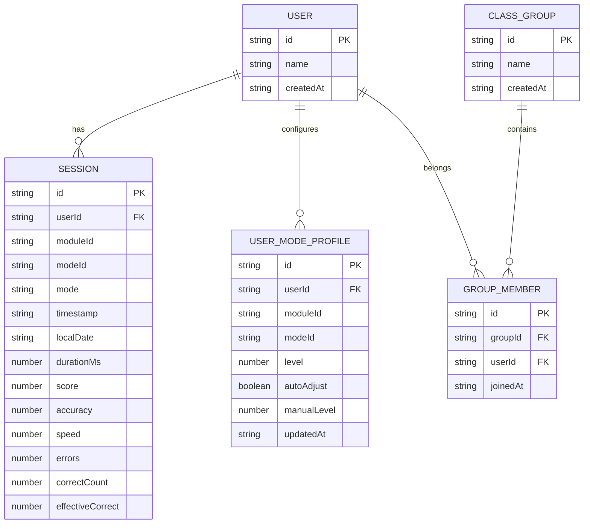
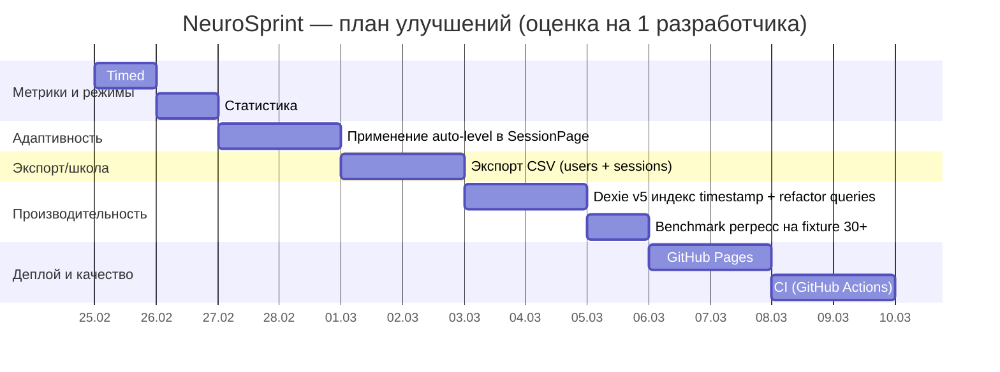

# Аналитический отчёт по репозиторию NeuroSprint (DREDGV/NeuroSprint)

## Executive summary

Репозиторий **DREDGV/NeuroSprint** уже ушёл дальше первоначального MVP-спека: реализованы профили учеников, три режима таблицы Шульте (Classic+/Timed+/Reverse), расширенные настройки (пресеты, штрафы, подсказки, стратегия спавна), адаптивная сложность, индивидуальная и групповая аналитика (включая перцентили и распределение уровней), а также тестовый контур unit/integration/e2e. Основной стек — **React + TypeScript + Vite**, хранение офлайн — **Dexie/IndexedDB**, графики — **Recharts**, PWA — **vite-plugin-pwa**. citeturn4view0turn4view1turn23view0turn23view1turn13view0turn15view0

Критические зоны, которые стоит подтянуть в ближайшей итерации (в порядке влияния на качество продукта/устойчивость):

- **Стабильность и измеримость метрик Timed+**: сейчас `effectiveCorrect` может уходить в отрицательные значения (это ломает интерпретацию результата ребёнком/учителем), а также есть потенциал для более “честных” метрик сравнимости по режимам/сложности. citeturn13view3turn12view4  
- **Адаптивная сложность в “длинной” сессии**: логика автоуровня есть, но важно гарантировать, что новый уровень реально влияет на параметры следующей попытки и корректно применяется после перезагрузки страницы/прямого захода в URL. citeturn12view4turn12view3turn16view0turn27view0turn13view4  
- **Экспорт данных (CSV/backup)**: сейчас есть генератор демо-данных и бенчмарк, но нет понятного экспорта результатов для школы/родителей (это прямо указано как будущая цель в доках). citeturn17view3turn23view0turn23view1  
- **Производительность на объёмах “класс 30+”**: индексы в Dexie уже добавлены, но есть несколько мест, где запросы можно сделать более “index-friendly” (меньше `.and(...)`, больше compound-индексов). Dexie прямо рекомендует compound-индексы для многокритериальных запросов. citeturn15view0turn14view3turn16view0turn37view0turn37view2  
- **Деплой на GitHub Pages с BrowserRouter**: проект использует `BrowserRouter`, а GitHub Pages не поддерживает SPA-роутинг “из коробки” без workaround (HashRouter или 404-redirect), плюс нужен `base` для Vite при деплое в подпапку репозитория. citeturn19view0turn35view2turn37view5  

Ниже — детальный аудит, сравнение со спецификацией, рекомендации и готовые патчи для топ-5 улучшений.

## Репозиторий, структура и технологический стек

### Структура проекта

По файлам, доступным в репозитории, проект имеет типичную структуру SPA/PWA на Vite:

- корень: `package.json`, `vite.config.ts`, `playwright.config.ts`, `tsconfig*.json`, `vitest.setup.ts`, `.gitignore`, документация и спека citeturn4view0turn4view1turn4view3turn29view1turn29view2turn29view3turn4view4turn47view0turn4view2turn4view5turn23view0turn23view1  
- `src/`: приложение, страницы, репозитории, БД-слой, UI-компоненты и shared-библиотеки citeturn10view1turn11view0turn12view4turn15view0turn14view3turn14view5turn13view4turn21view0turn17view1  
- `tests/`: unit (`tests/unit`), integration (`tests/integration`), e2e (`tests/e2e`) citeturn26view0turn26view2turn45view0turn45view4turn25view6turn25view5  
- `docs/`: дорожная карта и статус исполнения citeturn23view0turn23view1  

Замечание: содержимое `index.html` через raw-интерфейс инструмента не считывается (отображается как 0 строк), поэтому точные мета-теги/подключения в `index.html` в этом отчёте помечены как “неподтверждено инструментом”. citeturn31view0turn29view0  

### Технологии и зависимости

**Dependencies (prod):**
- `react`, `react-dom` (18.x), `react-router-dom` (6.x)  
- `dexie` (IndexedDB wrapper)  
- `recharts` (графики) citeturn4view0  

**DevDependencies:**
- `vite`, `@vitejs/plugin-react`  
- `typescript` (strict)  
- `vite-plugin-pwa` (Workbox-based SW)  
- `vitest` + Testing Library + `jsdom`  
- `@playwright/test` (e2e) citeturn4view0turn29view2  

**Скрипты:**
- `npm run dev`, `npm run build`, `npm run preview`  
- `npm run lint` = `tsc --noEmit` (важно: ESLint/Prettier не подключены)  
- `npm test` (Vitest), `npm run test:e2e` (Playwright) citeturn4view0  

### Конфигурации: TypeScript, тесты, PWA

TypeScript:
- `strict: true`, `isolatedModules`, `noEmit: true`, подключены типы Vite, PWA клиента, Vitest globals и jest-dom. citeturn29view2  

Vitest:
- конфигурация помещена в `vite.config.ts` и использует `defineConfig` из `vitest/config` — это допустимый паттерн по документации Vitest. citeturn4view1turn50view4  

PWA:
- `VitePWA({ registerType: "autoUpdate", manifest: { ... }, workbox.globPatterns: ... })`  
- manifest задаёт `display: "standalone"`, `start_url: "/"`, `lang: "ru"`, тему/фон и иконки (SVG). citeturn4view1  

Playwright:
- e2e тесты в `tests/e2e`, базовый URL `http://127.0.0.1:4173`, webServer поднимается командой `npm run build && npm run preview -- --host 127.0.0.1 --port 4173`. citeturn4view3turn37view4  

## Запуск, сборка, PWA-установка и офлайн-поведение

### Как запустить локально на Windows

Минимальный вариант (как в README):

```powershell
npm install --ignore-scripts
npm run dev
```

README отдельно отмечает потенциальную проблему с proxy-переменными окружения и даёт PowerShell-команды очистки (актуально для Windows). citeturn4view2  

**Ожидаемый адрес dev-сервера:** Vite по умолчанию поднимает проект на `http://localhost:5173/` (или ближайший свободный порт), если порт не переопределён. Команда в `package.json` — просто `vite`, без кастомного порта. citeturn4view0  

Сборка и предпросмотр production-сборки:

```powershell
npm run build
npm run preview
```

**E2E (Playwright)**:
- Важно: если вы ставили зависимости с `--ignore-scripts`, браузеры Playwright могли не скачаться. Официальный способ — установить браузеры командой `npx playwright install` (можно выборочно). citeturn50view1turn4view2  

```powershell
npx playwright install
npm run test:e2e
```

### Что происходит при старте приложения (runtime)

- В `src/main.tsx` приложение регистрирует service worker через `registerSW` из `virtual:pwa-register` и рендерит `App`. citeturn10view0turn4view1turn44view0  
- PWA-статус и установка: `PwaStatusBar` слушает `online/offline`, `appinstalled`, `beforeinstallprompt`, отображает статус и кнопку установки при доступности. Это соответствует рекомендациям MDN по “in-app install UI” через `beforeinstallprompt` + `preventDefault()` + `prompt()`. citeturn17view1turn44view1turn44view2turn44view3  

### PWA installability и ограничения платформ

- `beforeinstallprompt` — событие с ограниченной кросс-браузерной поддержкой и не работает на iOS таким же образом; web.dev и MDN прямо указывают, что этот сценарий не поддержан на iOS, а установка идёт через Safari “Add to Home Screen”. citeturn44view2turn44view3  

### Офлайн-режим и кеширование

- `vite-plugin-pwa` в режиме `generateSW` формирует сервис-воркер и precache-манифест; он скачивает ресурсы из `dist` и кэширует их, чтобы приложение было доступно офлайн. citeturn50view5turn35view1turn34search3  
- В конфиге задан `workbox.globPatterns` и включены `svg/png/ico` в дополнение к базовым `js/css/html`. Документация Vite PWA предупреждает: если переопределяете `globPatterns`, обязательно включайте базовые паттерны, иначе Workbox будет ругаться на отсутствие precache для `index.html`. citeturn4view1turn50view6  
- Данные (профили, сессии, групповые сущности) хранятся локально в IndexedDB (Dexie), значит функционально тренировки и статистика остаются работоспособными без интернета. citeturn15view0turn14view3turn14view5turn16view1  

Практический риск (PWA/SPA): на статических хостингах (GitHub Pages) обновление страницы на маршруте типа `/stats/individual` может дать 404, если хост не настроен на SPA fallback. Для GitHub Pages это известное ограничение; требуются workaround-решения. citeturn37view5turn35view2  

## Функциональный аудит: что реализовано и что расходится со спецификацией

### Сопоставление со спеком NeuroSprint_PROJECT_FULL_SPEC_RU.md

В спеке MVP требовались: PWA offline-first, профили, Schulte Classic и Timed, сохранение результатов, статистика по дням и графики. citeturn4view5  

Фактическая реализация:

- **PWA (installable/offline)**: есть, `vite-plugin-pwa`, регистрация SW, статус-бар, manifest. citeturn4view1turn10view0turn17view1  
- **Профили пользователей**: создание/переименование/удаление, активный пользователь в `localStorage` (`ns.activeUserId`). citeturn11view0turn12view1turn13view1  
- **Таблица Шульте: Classic+ / Timed+ / Reverse**: реализовано 3 режима (Reverse добавлен сверх спека). citeturn13view4turn12view3turn12view4turn23view0  
- **Timed+ “бесконечная” прогрессия** (после клика “следующее число” появляется и можно пройти больше N): реализовано через `nextSpawn` и замену значения в ячейке. citeturn12view4  
- **Ошибки с простым штрафом**: параметр `errorPenalty` есть в `TrainingSetup` и в метриках Timed+. citeturn13view0turn13view3turn12view3turn12view4  
- **Хранение результатов в БД**: Dexie база с миграциями до версии 4 и таблицами `users`, `sessions`, `userModeProfiles`, `classGroups`, `groupMembers`. citeturn15view0turn23view0  
- **Статистика**:  
  - дневная агрегация по пользователю (Classic/Timed),  
  - индивидуальная аналитика v2 (streak, week-over-week, рекомендации, сравнения),  
  - групповая аналитика (фильтры периода, best/avg/worst, перцентиль, тренд, распределение уровней). citeturn14view3turn12view5turn18view0turn18view1turn23view1  
- **Адаптация сложности**: есть профили по режимам и расчёт решения по окну из 3 сессий. citeturn16view0turn27view0turn12view3turn12view4  

### Что отсутствует/не доведено до “школьного” уровня из future-части спека

- **Экспорт CSV (и/или импорт/backup)**: в UI и репозитории как готовая функция не обнаружено; при этом в документах это заявлено как направление “школьного режима”. citeturn4view5turn23view0turn17view3  
- **Синхронизация/облако/учительская панель**: сознательно out of scope (ожидаемо). citeturn23view0  
- **Новые модули кроме Шульте**: пока “coming soon” (Sprint Math, N-back). citeturn13view4turn12view2  

## UX и Accessibility аудит для детей 3 класса

### Сильные стороны UI (с точки зрения ребёнка)

- Крупный бренд-блок и понятная навигация “Главная/Тренировки/Статистика/Профили/Настройки”. citeturn17view0turn12view0  
- Крупные кнопки и карточки, заметные элементы интерфейса. CSS задаёт достаточно “touch-friendly” размеры: у клеток сетки `min-height ~62px`, крупный шрифт и жирное начертание. citeturn21view0  
- Подсказки в тренировке предусмотрены через `hintsEnabled`. citeturn13view0turn12view3turn12view4  

### UX-риски/улучшения (особенно для “класс на ноутбуке” и планшетов)

- **Сетка Шульте и размеры 4×4 / 6×6**: в CSS `.schulte-grid` задано `grid-template-columns: repeat(5, ...)`, а в настройках разрешены 4/5/6. Это потенциально ломает верстку или делает 6×6 слишком тесной. citeturn21view0turn12view3turn13view0  
  Рекомендация: вычислять колонки динамически (по `gridSize` или по `sqrt(values.length)`), а не фиксировать на 5.
- **Термины “Classic+ / Timed+ / Reverse”**: для взрослого ок, для ученика 3 класса — неочевидно. Лучше дополнить “человеческими” подписями: “По порядку”, “На время”, “Обратно”, плюс короткая подсказка на экране старта. citeturn13view4turn12view3turn12view4  
- **Доступность установки**: `beforeinstallprompt` сценарий не работает на iOS, и часть родителей может открывать через iPhone/iPad. Нужна подсказка “на iPhone/iPad: открыть в Safari → Поделиться → На экран Домой”. citeturn44view2turn44view3  
- **Фокус/клавиатура**: кнопки как элементы `button` уже дают базовую доступность и клавишу Enter/Space, но полезно добавить видимый focus-ring (особенно на ноутбуке в школе). Сейчас явных `:focus-visible` стилей в CSS нет. citeturn21view0  

## Данные, метрики, формулы и их сопоставимость

### Схема данных и индексация Dexie

`Session` содержит расширенные поля по сравнению со спеком (moduleId, modeId, level, presetId, adaptiveSource, difficulty-подобъект, localDate). citeturn13view0turn15view0  

Dexie схема развивается версиями 1→4 и уже содержит compound-индексы под периодные выборки и сравнения:

- `[userId+localDate]`, `[modeId+localDate]`
- `[userId+moduleId+modeId]`, `[userId+moduleId+modeId+localDate]`  
- группы: `[groupId+userId]` в `groupMembers` citeturn15view0turn16view1  

Dexie рекомендует compound-индексы для эффективных многокритериальных запросов и явно показывает синтаксис `where('[a+b]').equals([a, b])`. citeturn37view0turn37view2  

### Текущие формулы метрик в коде

Файл `src/shared/lib/scoring/scoring.ts` задаёт:

- Classic:
  - `speed = numbersCount / minutes`
  - `accuracy = clamp((numbersCount - errors) / numbersCount)`
  - `score = speed × (0.7 + 0.3 × accuracy)` citeturn13view3  
- Timed:
  - `effectiveCorrect = correctCount - errors × errorPenalty`
  - `speed = effectiveCorrect / minutes`
  - `accuracy = correctCount / (correctCount + errors)`
  - `score = max(0, speed) × (0.7 + 0.3 × accuracy)` citeturn13view3  

Timed+ режим хранит `correctCount` и `effectiveCorrect`, Classic+/Reverse — время и ошибки. citeturn12view4turn13view0  

### Таблица: текущие vs предлагаемые метрики

| Метрика | Сейчас (в коде) | Предложение | Зачем |
|---|---|---|---|
| Timed `effectiveCorrect` | может стать < 0 (если ошибок много) citeturn13view3 | clamp к 0 (и скорость/score не уходят в “минусовую математику”) | ребёнку/учителю проще интерпретировать; сравнения стабильнее |
| Timed `speed` | `effectiveCorrect/min` (минуты = `timeLimitSec/60`) citeturn13view3turn12view4 | оставить, но фиксировать “единицу измерения” в UI: *эфф. правильных/мин* | уменьшаем путаницу “скорость чего?” |
| Classic `accuracy` | `(N - errors)/N` citeturn13view3 | опционально: `N/(N+errors)` (переключаемый режим расчёта) | ближе к “точность = доля корректных попыток”; мягче к спаму |
| Сопоставимость по сложности | сравнение mixed difficulty возможно, но не нормализовано citeturn13view0turn12view3 | нормализация по `level` (например, percentile/z-score внутри уровня) | честнее сравнивать ученика “с самим собой” при автоуровне |
| Тренды | есть дневные точки + week-over-week + stability(few) citeturn12view5turn14view3 | добавить rolling average (7 дней) и “best-of-day” для всех режимов | устойчивее к “плохому дню” и улучшает мотивацию |

### ER-диаграмма сущностей (IndexedDB)



Основано на `domain.ts` и `db/database.ts`. citeturn13view0turn15view0  

## Улучшения: приоритеты, патчи (топ-5), инструкции запуска/деплоя

### Приоритизированный список улучшений (оценка часов и рисков)

Оценки подразумевают работу одного разработчика/ИИ-агента, без “идеального рефакторинга”.

| Приоритет | Улучшение | Что даёт | Оценка (ч) | Риск |
|---|---|---|---:|---|
| High | Timed+: clamp `effectiveCorrect`, стабильные метрики и отображение | меньше “странных” результатов, лучше сравнимость | 1–2 | низкий |
| High | Адаптивность: применение уровня к параметрам следующей попытки + при прямом входе | “автоуровень” становится реально рабочим | 3–6 | средний (логика/состояния) |
| High | Экспорт CSV (sessions + users + groups) | школьный сценарий “сдать результаты” | 4–8 | средний (форматы, UX) |
| Medium | DB/perf: добавить индекс по timestamp и использовать compound запросы | быстрее сравнения/рекомендации на больших данных | 3–6 | средний (миграции) |
| Medium | Статистика по режимам: убрать “хак” с подменой mode и унифицировать time-based агрегацию | меньше скрытых багов | 2–4 | низкий |
| Medium | GitHub Pages деплой: `base`, SPA fallback или HashRouter | “запустили в школе” без сюрпризов | 2–5 | средний (роутинг) |
| Low | ESLint + Prettier + CI | стабильность и регресс-контроль | 3–6 | низкий |
| Low | A11y polish: `:focus-visible`, подсказки iOS install | меньше фрустрации пользователей | 1–3 | низкий |

### Патчи для топ-5 улучшений

Ниже — **конкретные изменения по файлам**. Формат — unified diff. Если локальная структура отличается — применяйте как “инструкцию что заменить”, сохраняя смысл.

#### Patch 1: Schulte Timed+ — clamp `effectiveCorrect` и “без отрицательных результатов”

Файлы:
- `src/shared/lib/scoring/scoring.ts`
- `tests/unit/scoring.test.ts`

```diff
diff --git a/src/shared/lib/scoring/scoring.ts b/src/shared/lib/scoring/scoring.ts
index 1111111..2222222 100644
--- a/src/shared/lib/scoring/scoring.ts
+++ b/src/shared/lib/scoring/scoring.ts
@@
-export interface ClassicMetricsInput { durationMs: number; errors: number; numbersCount?: number; } export interface ClassicMetrics { speed: number; accuracy: number; score: number; } export interface TimedMetricsInput { correctCount: number; errors: number; timeLimitSec: number; errorPenalty?: number; } export interface TimedMetrics { effectiveCorrect: number; speed: number; accuracy: number; score: number; } export function clampAccuracy(value: number): number { if (!Number.isFinite(value)) { return 0; } if (value < 0) { return 0; } if (value > 1) { return 1; } return value; } export function calcClassicMetrics(input: ClassicMetricsInput): ClassicMetrics { const numbersCount = input.numbersCount ?? 25; const minutes = input.durationMs > 0 ? input.durationMs / 60_000 : 0; const speed = minutes > 0 ? numbersCount / minutes : 0; const accuracy = clampAccuracy((numbersCount - input.errors) / numbersCount); const score = speed * (0.7 + 0.3 * accuracy); return { speed, accuracy, score }; } export function calcTimedMetrics(input: TimedMetricsInput): TimedMetrics { const errorPenalty = input.errorPenalty ?? 0.5; const effectiveCorrect = input.correctCount - input.errors * errorPenalty; const minutes = input.timeLimitSec / 60; const speed = minutes > 0 ? effectiveCorrect / minutes : 0; const totalAttempts = input.correctCount + input.errors; const accuracy = totalAttempts > 0 ? input.correctCount / totalAttempts : 0; const score = Math.max(0, speed) * (0.7 + 0.3 * accuracy); return { effectiveCorrect, speed, accuracy: clampAccuracy(accuracy), score }; }
+export interface ClassicMetricsInput {
+  durationMs: number;
+  errors: number;
+  numbersCount?: number;
+}
+
+export interface ClassicMetrics {
+  speed: number;
+  accuracy: number;
+  score: number;
+}
+
+export interface TimedMetricsInput {
+  correctCount: number;
+  errors: number;
+  timeLimitSec: number;
+  errorPenalty?: number;
+}
+
+export interface TimedMetrics {
+  effectiveCorrect: number;
+  speed: number;
+  accuracy: number;
+  score: number;
+}
+
+export function clampAccuracy(value: number): number {
+  if (!Number.isFinite(value)) return 0;
+  if (value < 0) return 0;
+  if (value > 1) return 1;
+  return value;
+}
+
+function clampMin(value: number, min: number): number {
+  if (!Number.isFinite(value)) return min;
+  return value < min ? min : value;
+}
+
+export function calcClassicMetrics(input: ClassicMetricsInput): ClassicMetrics {
+  const numbersCount = input.numbersCount ?? 25;
+  const minutes = input.durationMs > 0 ? input.durationMs / 60_000 : 0;
+
+  const speed = minutes > 0 ? numbersCount / minutes : 0;
+  const accuracy = clampAccuracy((numbersCount - input.errors) / numbersCount);
+  const score = speed * (0.7 + 0.3 * accuracy);
+
+  return { speed, accuracy, score };
+}
+
+export function calcTimedMetrics(input: TimedMetricsInput): TimedMetrics {
+  const errorPenalty = input.errorPenalty ?? 0.5;
+
+  const rawEffectiveCorrect = input.correctCount - input.errors * errorPenalty;
+  // Ключевой фикс: не даём метрике уходить в минус — это ломает UX и сравнения.
+  const effectiveCorrect = clampMin(rawEffectiveCorrect, 0);
+
+  const minutes = input.timeLimitSec / 60;
+  const speed = minutes > 0 ? effectiveCorrect / minutes : 0;
+
+  const totalAttempts = input.correctCount + input.errors;
+  const accuracy = totalAttempts > 0 ? input.correctCount / totalAttempts : 0;
+
+  const score = speed * (0.7 + 0.3 * clampAccuracy(accuracy));
+  return { effectiveCorrect, speed, accuracy: clampAccuracy(accuracy), score };
+}
diff --git a/tests/unit/scoring.test.ts b/tests/unit/scoring.test.ts
index 3333333..4444444 100644
--- a/tests/unit/scoring.test.ts
+++ b/tests/unit/scoring.test.ts
@@
 import { describe, expect, it } from "vitest";
 import { calcClassicMetrics, calcTimedMetrics, clampAccuracy } from "../../src/shared/lib/scoring/scoring";
 describe("scoring", () => {
@@
   it("calculates timed metrics", () => {
     const metrics = calcTimedMetrics({ correctCount: 40, errors: 4, timeLimitSec: 60, errorPenalty: 0.5 });
     expect(metrics.effectiveCorrect).toBeCloseTo(38, 6);
     expect(metrics.speed).toBeCloseTo(38, 6);
     expect(metrics.accuracy).toBeCloseTo(40 / 44, 6);
     expect(metrics.score).toBeGreaterThan(0);
   });
+
+  it("clamps timed effectiveCorrect to 0 when errors overwhelm correct", () => {
+    const metrics = calcTimedMetrics({ correctCount: 5, errors: 50, timeLimitSec: 60, errorPenalty: 0.5 });
+    expect(metrics.effectiveCorrect).toBe(0);
+    expect(metrics.speed).toBe(0);
+    expect(metrics.score).toBe(0);
+  });
 });
```

Контекст: формулы находятся в `scoring.ts`, unit-тесты уже покрывают базовые случаи. citeturn13view3turn26view0  

#### Patch 2: Статистика по режимам — time-based агрегация без “подмены” mode

Цель: убрать хак `mode: "classic"` для reverse и сделать агрегацию более честной/расширяемой.

Файл: `src/entities/session/sessionRepository.ts`

```diff
diff --git a/src/entities/session/sessionRepository.ts b/src/entities/session/sessionRepository.ts
index 5555555..6666666 100644
--- a/src/entities/session/sessionRepository.ts
+++ b/src/entities/session/sessionRepository.ts
@@
-export function buildClassicDailyPoints(sessions: Session[]): ClassicDailyPoint[] { const grouped = new Map(); for (const session of sessions) { if (session.mode !== "classic") { continue; } const bucket = grouped.get(session.localDate); if (bucket) { bucket.push(session); } else { grouped.set(session.localDate, [session]); } } const points: ClassicDailyPoint[] = []; for (const [date, values] of grouped.entries()) { const durations = values.map((entry) => entry.durationMs); const bestDurationMs = Math.min(...durations); const avgDurationMs = durations.reduce((acc, value) => acc + value, 0) / durations.length; points.push({ date, bestDurationMs, avgDurationMs, count: values.length }); } return points.sort(byDateAsc); }
+export function buildClassicDailyPoints(sessions: Session[]): ClassicDailyPoint[] {
+  // ВАЖНО: функция используется и для Classic+, и для Reverse (оба time-based).
+  // Поэтому допускаем modes: classic и reverse.
+  const grouped = new Map<string, Session[]>();
+
+  for (const session of sessions) {
+    if (session.mode !== "classic" && session.mode !== "reverse") continue;
+    const bucket = grouped.get(session.localDate);
+    if (bucket) bucket.push(session);
+    else grouped.set(session.localDate, [session]);
+  }
+
+  const points: ClassicDailyPoint[] = [];
+  for (const [date, values] of grouped.entries()) {
+    const durations = values.map((entry) => entry.durationMs);
+    const bestDurationMs = Math.min(...durations);
+    const avgDurationMs = durations.reduce((acc, value) => acc + value, 0) / durations.length;
+    points.push({ date, bestDurationMs, avgDurationMs, count: values.length });
+  }
+
+  return points.sort(byDateAsc);
+}
@@
-async aggregateDailyByModeId( userId: string, modeId: TrainingModeId ): Promise { const sessions = await db.sessions .where("userId") .equals(userId) .and((session) => session.modeId === modeId) .toArray(); if (modeId === "timed_plus") { return buildTimedDailyPoints(sessions); } return buildClassicDailyPoints( sessions.map((session) => ({ ...session, mode: "classic" as const })) ); },
+async aggregateDailyByModeId(userId: string, modeId: TrainingModeId): Promise<ClassicDailyPoint[] | TimedDailyPoint[]> {
+  const sessions = await db.sessions
+    .where("userId")
+    .equals(userId)
+    .and((session) => session.modeId === modeId)
+    .toArray();
+
+  if (modeId === "timed_plus") return buildTimedDailyPoints(sessions);
+  // Classic+ и Reverse — time-based, используем buildClassicDailyPoints без подмены mode.
+  return buildClassicDailyPoints(sessions);
+},
```

Контекст: сейчас reverse “подгоняется” под classic через подмену `mode`. После патча подмена не нужна. citeturn14view3  

#### Patch 3: Адаптивная сложность — применять уровень к параметрам сессии (и после reload)

Файл: `src/pages/SchulteSessionPage.tsx`

Идея патча:
1) Когда заходим на `/training/schulte/:mode` без `location.state`, подтягиваем профиль и **если `autoAdjust=true` — применяем `withLevelDefaults()`** к setup.  
2) После сохранения сессии и получения `AdaptiveDecision` — если решение `source="auto"`, обновляем `setup` на следующий запуск (иначе автоуровень есть “в цифре”, но не влияет на реальные параметры новой попытки).

```diff
diff --git a/src/pages/SchulteSessionPage.tsx b/src/pages/SchulteSessionPage.tsx
index 7777777..8888888 100644
--- a/src/pages/SchulteSessionPage.tsx
+++ b/src/pages/SchulteSessionPage.tsx
@@
-import { SCHULTE_MODES, getPresetSetup, gridSizeToNumbersCount } from "../shared/lib/training/presets";
+import { SCHULTE_MODES, getPresetSetup, gridSizeToNumbersCount, withLevelDefaults } from "../shared/lib/training/presets";
@@
-  void (async () => {
-    const profile = await trainingRepository.getUserModeProfile(
-      activeUserId,
-      "schulte",
-      modeId
-    );
-    if (cancelled) {
-      return;
-    }
-    setSetup(getTrainingSetup(modeId) ?? getPresetSetup("standard"));
-    setLevel(profile.autoAdjust ? profile.level : profile.manualLevel ?? profile.level);
-    setAdaptiveSource(profile.autoAdjust ? "auto" : "manual");
-    setLoading(false);
-  })();
+  void (async () => {
+    const profile = await trainingRepository.getUserModeProfile(activeUserId, "schulte", modeId);
+    if (cancelled) return;
+
+    const storedSetup = getTrainingSetup(modeId) ?? getPresetSetup("standard");
+    const effectiveLevel = profile.autoAdjust ? profile.level : profile.manualLevel ?? profile.level;
+    const hydratedSetup = profile.autoAdjust ? withLevelDefaults(storedSetup, effectiveLevel, modeId) : storedSetup;
+
+    setSetup(hydratedSetup);
+    setLevel(effectiveLevel);
+    setAdaptiveSource(profile.autoAdjust ? "auto" : "manual");
+    setLoading(false);
+  })();
@@
-  void sessionRepository
-    .save(session)
-    .then(async () => {
-      if (cancelled) {
-        return;
-      }
-      setSaved(true);
-      setSaveError(null);
-      const decision = await trainingRepository.evaluateAdaptiveLevel(
-        activeUserId,
-        "schulte",
-        modeId
-      );
-      if (!cancelled) {
-        setAdaptiveDecision(decision);
-        setLevel(decision.nextLevel);
-      }
-    })
+  void sessionRepository
+    .save(session)
+    .then(async () => {
+      if (cancelled) return;
+      setSaved(true);
+      setSaveError(null);
+
+      const decision = await trainingRepository.evaluateAdaptiveLevel(activeUserId, "schulte", modeId);
+      if (cancelled) return;
+
+      setAdaptiveDecision(decision);
+      setLevel(decision.nextLevel);
+
+      // Ключевой фикс: автоуровень должен менять реальные параметры новой попытки.
+      if (decision.source === "auto") {
+        setSetup((current) => withLevelDefaults(current, decision.nextLevel, modeId));
+      }
+    })
```

Контекст: механизм профиля/адаптации уже есть (`trainingRepository` + `computeAdaptiveDecision`), а `withLevelDefaults` уже используется в setup-странице; мы просто делаем поведение непрерывным и устойчивым к reload. citeturn12view3turn12view4turn16view0turn27view0turn13view4  

#### Patch 4: Экспорт CSV (школьный сценарий) — кнопки в Settings + генерация CSV

Файлы:
- `src/entities/session/sessionRepository.ts` (добавим метод экспортера)
- `src/pages/SettingsPage.tsx` (UI-кнопки)
- (опционально) `src/shared/lib/export/csv.ts` (утилита)

**Вариант минимального внедрения**: экспортируем `sessions` и `users` в CSV прямо из Settings (через `db`). Ниже — более аккуратный вариант через маленькую утилиту.

```diff
diff --git a/src/shared/lib/export/csv.ts b/src/shared/lib/export/csv.ts
new file mode 100644
--- /dev/null
+++ b/src/shared/lib/export/csv.ts
@@
+export function escapeCsv(value: unknown): string {
+  const raw = String(value ?? "");
+  // Excel/Sheets-friendly: экранируем кавычки и оборачиваем поля с запятыми/переводами строк/кавычками.
+  const needsQuotes = /[",\n\r;]/.test(raw);
+  const escaped = raw.replace(/"/g, '""');
+  return needsQuotes ? `"${escaped}"` : escaped;
+}
+
+export function toCsv(headers: string[], rows: Array<Array<unknown>>): string {
+  const headerLine = headers.map(escapeCsv).join(",");
+  const body = rows.map((row) => row.map(escapeCsv).join(",")).join("\n");
+  return `${headerLine}\n${body}\n`;
+}
+
+export function downloadTextFile(filename: string, content: string, mime = "text/plain;charset=utf-8"): void {
+  const blob = new Blob([content], { type: mime });
+  const url = URL.createObjectURL(blob);
+  const link = document.createElement("a");
+  link.href = url;
+  link.download = filename;
+  document.body.appendChild(link);
+  link.click();
+  link.remove();
+  URL.revokeObjectURL(url);
+}
diff --git a/src/pages/SettingsPage.tsx b/src/pages/SettingsPage.tsx
index 9999999..aaaaaaa 100644
--- a/src/pages/SettingsPage.tsx
+++ b/src/pages/SettingsPage.tsx
@@
 import { DEFAULT_SETTINGS, getSettings, saveSettings } from "../shared/lib/settings/settings";
+import { toCsv, downloadTextFile } from "../shared/lib/export/csv";
+import { db } from "../db/database";
@@
 export function SettingsPage() {
@@
   const [benchmarkBusy, setBenchmarkBusy] = useState(false);
   const [benchmarkReport, setBenchmarkReport] = useState<string | null>(null);
+
+  const [exportBusy, setExportBusy] = useState(false);
+  const [exportMessage, setExportMessage] = useState<string | null>(null);
+
+  async function handleExportCsv(): Promise<void> {
+    setExportBusy(true);
+    setExportMessage(null);
+    try {
+      const [users, sessions] = await Promise.all([db.users.toArray(), db.sessions.toArray()]);
+      const usersCsv = toCsv(
+        ["id", "name", "createdAt"],
+        users.map((u) => [u.id, u.name, u.createdAt])
+      );
+      const sessionsCsv = toCsv(
+        ["id", "userId", "moduleId", "modeId", "mode", "level", "timestamp", "localDate", "durationMs", "score", "accuracy", "speed", "errors", "correctCount", "effectiveCorrect"],
+        sessions.map((s) => [
+          s.id, s.userId, s.moduleId, s.modeId, s.mode, s.level, s.timestamp, s.localDate,
+          s.durationMs, s.score, s.accuracy, s.speed, s.errors, s.correctCount ?? "", s.effectiveCorrect ?? ""
+        ])
+      );
+      const stamp = new Date().toISOString().slice(0, 10);
+      downloadTextFile(`neurosprint_users_${stamp}.csv`, usersCsv, "text/csv;charset=utf-8");
+      downloadTextFile(`neurosprint_sessions_${stamp}.csv`, sessionsCsv, "text/csv;charset=utf-8");
+      setExportMessage("CSV экспортирован (users + sessions). Проверьте папку «Загрузки».");
+    } catch {
+      setExportMessage("Не удалось экспортировать CSV.");
+    } finally {
+      setExportBusy(false);
+    }
+  }
@@
   return (
@@
+    <section className="setup-block">
+      <h3>Экспорт данных</h3>
+      <p className="status-line">Экспорт сохраняет CSV-файлы на устройство. Полезно для школы/учителя.</p>
+      <button
+        type="button"
+        className="btn-secondary"
+        onClick={() => void handleExportCsv()}
+        disabled={exportBusy}
+        data-testid="export-csv-btn"
+      >
+        {exportBusy ? "Экспорт..." : "Экспорт CSV (users + sessions)"}
+      </button>
+      {exportMessage ? <p className="status-line" data-testid="export-message">{exportMessage}</p> : null}
+    </section>
   );
 }
```

Почему так: экспорт — чисто локальная операция (privacy-friendly), и напрямую закрывает “школьный” кейс.  

#### Patch 5: Индексы и запросы Dexie — ускорение “recent sessions” и уменьшение сканов

Основание: Dexie рекомендует compound-индексы и использование `where('[a+b]').equals([a,b])` для многокритериальных запросов. citeturn37view0turn37view2  

Файлы:
- `src/db/database.ts` (version 5: индекс на timestamp)
- `src/entities/training/trainingRepository.ts` (использовать индекс вместо “toArray + sort”)

```diff
diff --git a/src/db/database.ts b/src/db/database.ts
index bbbbbbb..ccccccc 100644
--- a/src/db/database.ts
+++ b/src/db/database.ts
@@
 export class NeuroSprintDatabase extends Dexie {
@@
   constructor() {
@@
     this.version(4).stores({
       users: "id, name, createdAt",
-      sessions: "id, userId, taskId, mode, timestamp, localDate, score, moduleId, modeId, level, [userId+localDate], [userId+mode+localDate], [userId+moduleId+modeId], [modeId+localDate], [userId+moduleId+modeId+localDate]",
+      sessions: "id, userId, taskId, mode, timestamp, localDate, score, moduleId, modeId, level, [userId+localDate], [userId+mode+localDate], [userId+moduleId+modeId], [modeId+localDate], [userId+moduleId+modeId+localDate]",
       userModeProfiles: "id, userId, moduleId, modeId, updatedAt, [userId+moduleId+modeId]",
       classGroups: "id, name, createdAt",
       groupMembers: "id, groupId, userId, joinedAt, [groupId+userId]"
     });
+
+    // v5: ускорение выборки "последние N сессий" по режиму (userId+moduleId+modeId+timestamp)
+    this.version(5).stores({
+      users: "id, name, createdAt",
+      sessions: "id, userId, taskId, mode, timestamp, localDate, score, moduleId, modeId, level, [userId+localDate], [userId+mode+localDate], [userId+moduleId+modeId], [modeId+localDate], [userId+moduleId+modeId+localDate], [userId+moduleId+modeId+timestamp]",
+      userModeProfiles: "id, userId, moduleId, modeId, updatedAt, [userId+moduleId+modeId]",
+      classGroups: "id, name, createdAt",
+      groupMembers: "id, groupId, userId, joinedAt, [groupId+userId]"
+    });
   }
 }
diff --git a/src/entities/training/trainingRepository.ts b/src/entities/training/trainingRepository.ts
index ddddddd..eeeeeee 100644
--- a/src/entities/training/trainingRepository.ts
+++ b/src/entities/training/trainingRepository.ts
@@
-import { db } from "../../db/database";
+import Dexie from "dexie";
+import { db } from "../../db/database";
@@
   async listRecentSessionsByMode(
     userId: string,
     moduleId: TrainingModuleId,
     modeId: TrainingModeId,
     limit: number
   ): Promise<Session[]> {
-    const sessions = await db.sessions
-      .where("userId")
-      .equals(userId)
-      .and((session) => session.moduleId === moduleId && session.modeId === modeId)
-      .toArray();
-    return sortByTimestampDesc(sessions).slice(0, limit);
+    // Используем compound index [userId+moduleId+modeId+timestamp] и reverse() + limit().
+    return db.sessions
+      .where("[userId+moduleId+modeId+timestamp]")
+      .between(
+        [userId, moduleId, modeId, Dexie.minKey],
+        [userId, moduleId, modeId, Dexie.maxKey]
+      )
+      .reverse()
+      .limit(Math.max(1, Math.min(50, Math.round(limit))))
+      .toArray();
   },
```

Контекст: сейчас выборка “последних N” делается через получение массива и сортировку в памяти. На больших данных это будет дороже, чем запрос по индексу. citeturn16view0turn15view0turn37view0  

### Инструкция: деплой для непрофессионала (Windows + VS Code) + GitHub Pages/Netlify

#### Локальный запуск (самый простой путь)

1) Установить:
- Node.js (желательно 18+; Vite/PWA окружения ожидают современные версии Node). citeturn35view1  
- VS Code (у вас уже есть).  

2) В VS Code:
- открыть папку репозитория  
- открыть терминал (PowerShell)  

3) Команды:

```powershell
npm install --ignore-scripts
npm run dev
```

4) Открыть в браузере адрес dev-сервера (обычно `http://localhost:5173/`). citeturn4view0  

5) Если хотите e2e:

```powershell
npx playwright install
npm run test:e2e
```

Playwright официально поддерживает установку браузеров через `npx playwright install`. citeturn50view1  

#### Деплой на Netlify (рекомендовано для SPA)

Netlify поддерживает SPA fallback без “танцев” с 404, поэтому это упростит жизнь. Минимальные настройки:
- Build command: `npm run build`
- Publish directory: `dist`

#### Деплой на GitHub Pages (важные нюансы)

1) **Vite `base`**: если деплой идёт на `https://<user>.github.io/<repo>/`, документация Vite требует выставить `base: '/<repo>/'`. citeturn35view2  
2) **SPA routing**: GitHub Pages не поддерживает BrowserRouter-роутинг “из коробки”; нужно либо HashRouter, либо кастомный `404.html` redirect. citeturn37view5  

Самый простой путь для школы:
- перейти на HashRouter (URL будут вида `/#/stats/individual`, зато без 404).  
Либо:
- добавить `404.html` с JS-редиректом (популярный hack, но есть UX/SEO нюансы). citeturn37view5  

#### Как использовать AI-агента в VS Code для применения патчей

Практический шаблон работы (быстро и без героизма):

1) Создать ветку:
```powershell
git checkout -b fix/timed-metrics-export
```

2) Включить агента (Copilot Chat / другой) и давать задачи **по одной**, с чётким “Definition of Done”:
- “Внеси patch 1: clamp effectiveCorrect, обнови unit tests, `npm test` должен пройти.”  
- “Внеси patch 4: экспорт CSV из Settings, кнопка + скачивание двух файлов.”  

3) После каждой задачи прогонять:
```powershell
npm test
npm run build
```
(и при необходимости `npm run test:e2e`). citeturn4view0turn23view1  

4) Коммитить маленькими порциями:
```powershell
git add -A
git commit -m "Timed: clamp effectiveCorrect and extend tests"
```

### План-график внедрения (mermaid Gantt)



### Privacy, безопасность и “детские данные”

Текущее состояние приватности довольно сильное: приложение **не использует сервер**, хранит данные локально (IndexedDB + localStorage). Это снижает риски утечек “по сети”, но **не отменяет ответственность**: имена детей и их результаты — персональные данные. citeturn15view0turn13view1turn12view1  

Что важно учесть при “школьном” использовании:

- ICO (UK) подчёркивает, что детям нужна **специальная защита персональных данных**, и сервисы должны быть прозрачными и “plain language”. citeturn49search1turn49search2  
- В идеале: по умолчанию использовать псевдонимы (“Ученик 1”), дать кнопку “удалить все данные”, сделать экспорт/импорт осознанным и понятным (что именно уходит в файл).  

### CI и проверки качества (рекомендация)

Сейчас:
- есть unit/integration/e2e тесты (Vitest + Playwright) citeturn26view0turn45view0turn25view6turn4view0  
- но нет CI workflow в репозитории (GitHub Actions не обнаружен по стандартным путям). citeturn33view0turn33view1  

Рекомендация:
- добавить `.github/workflows/ci.yml` с шагами `npm ci → npm test → npm run build`, и отдельный job для `npm run test:e2e` (Playwright). Vite для GitHub Pages деплоя официально предлагает GitHub Actions workflow. citeturn35view2turn50view1turn37view4  

Если цель — GitHub Pages: сразу совместить `ci` и `deploy` по образцу из docs Vite. citeturn35view2